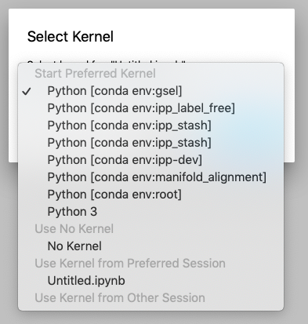

# jupyter notebook conda server
Sets up a Jupiter notebook server that allows you to access your other Conda environments as Jupyter notebook kernels

## Installation
```
git clone git@github.com:gregjohnso/jupyter_notebook_conda_server.git
cd jupyter_notebook_server
conda env create -f environment.yml
```
Note: The other Conda environments should have the `ipykernel` Conda package installed.

## Running the Jupter notebook server

```
cd ./jupyter_notebook_server
conda activate jupyter_notebook_conda_server
jupyter lab --notebook-dir='/allen/aics/modeling/'$USER
```

(Additional configurations can be set in `jupyter_notebook_config.py`)

On the top menu bar, you should be able to see other conda envs by going to 
`Kernel > Change Kernel...`

and you will get a pop-up that looks like this (for example):  

